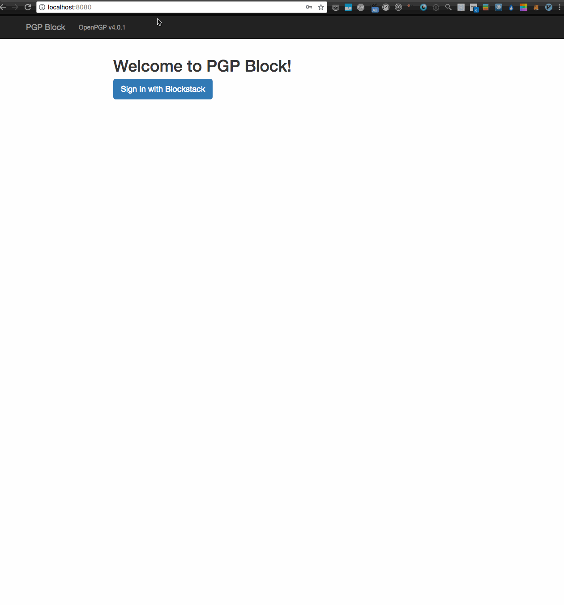

# PGP Block

**PGP Block** is a simple PGP tool built using Blockstack and OpenPGP v4.0.1. It enables you to easily create a new PGP keys, save the encrypted keys on Blockstack, and to use the keys to encrypt / decrypt messages.

## Installation

#### npm / yarn install
``` bash
yarn install
```

#### Run the server
``` bash
npm start
```

#### Create a Blockstack account / Open Blockstack browser

#### Use the app
http://localhost:8080/


